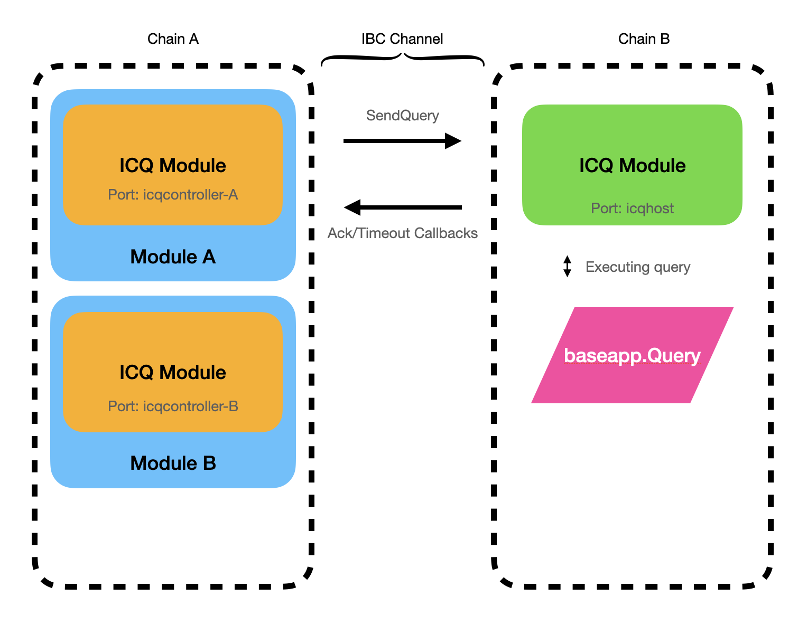

## Interchain Queries

This document serves as a guide for a better understanding of the implementation of interchain queries via ABCI Query

### Motivation

Interchain Queries enable blockchains to query the state of an account on another chain without the need for ICA auth. ICS-27 Interchain Accounts is used for IBC transactions, e.g. to transfer coins from one interchain account to another, whereas Interchain Queries is used for IBC Query, e.g. to query the balance of an account on another chain. 
In short, ICA is cross chain writes while ICQ is cross chain reads.

### Definitions 

- `Host Chain`: The chain where the query is sent. The host chain listens for IBC packets from a controller chain that contain instructions (e.g. cosmos SDK messages) that the interchain account will execute.
- `Controller Chain`: The chain sending the query to the host chain. The controller chain sends IBC packets to the host chain to query information.
- `Interchain Query`: An IBC packet that contains information about the query in the form of ABCI RequestQuery

The chain which sends the query becomes the controller chain, and the chain which receives the query and responds becomes the host chain for the scenario.

### Desired properties

- Permissionless: An interchain query may be created by any actor without the approval of a third party (e.g. chain governance)


## Technical Specification




### ABCI Query

ABCI RequestQuery enables blockchains to request information made by the end-users of applications. A query is received by a full node through its consensus engine and relayed to the application via the ABCI. It is then routed to the appropriate module via BaseApp's query router so that it can be processed by the module's query service

ICQ can only return information from stale reads, for a read that requires consensus, ICA will be used.


#### **SendQuery**

`SendQuery` is used to send an IBC packet containing query information to an interchain account on a host chain.

```go
func (k Keeper) SendQuery(ctx sdk.Context, sourcePort, sourceChannel string, chanCap *capabilitytypes.Capability, 
reqs []abci.RequestQuery, timeoutHeight clienttypes.Height, timeoutTimestamp uint64) (uint64, error) {
	
    sourceChannelEnd, found := k.channelKeeper.GetChannel(ctx, sourcePort, sourceChannel)
	if !found {
		return 0, sdkerrors.Wrapf(channeltypes.ErrChannelNotFound, "port ID (%s) channel ID (%s)", sourcePort, sourceChannel)
	}

	destinationPort := sourceChannelEnd.GetCounterparty().GetPortID()
	destinationChannel := sourceChannelEnd.GetCounterparty().GetChannelID()

	icqPacketData := types.InterchainQueryPacketData{
		Requests: reqs,
	}

	return k.createOutgoingPacket(ctx, sourcePort, sourceChannel, destinationPort, destinationChannel, chanCap, icqPacketData, timeoutTimestamp)
}
```

#### **authenticateQuery**

`authenticateQuery` is called before `executeQuery`.
`authenticateQuery` checks that the query is a part of the whitelisted queries.

```go
func (k Keeper) authenticateQuery(ctx sdk.Context, q abci.RequestQuery) error {
	allowQueries := k.GetAllowQueries(ctx)
	if !types.ContainsQueryPath(allowQueries, q.Path) {
		return sdkerrors.Wrapf(sdkerrors.ErrUnauthorized, "query path not allowed: %s", q.Path)
	}
	if !(q.Height == 0 || q.Height == ctx.BlockHeight()) {
		return sdkerrors.Wrapf(sdkerrors.ErrUnauthorized, "query height not allowed: %d", q.Height)
	}
	if q.Prove {
		return sdkerrors.Wrapf(sdkerrors.ErrUnauthorized, "query proof not allowed")
	}

	return nil
}
```


#### **executeQuery**

Executes each query sent by the controller chain.

```go
func (k Keeper) executeQuery(ctx sdk.Context, reqs []abci.RequestQuery) ([]byte, error) {
	resps := make([]abci.ResponseQuery, len(reqs))
	for i, req := range reqs {
		if err := k.authenticateQuery(ctx, req); err != nil {
			return nil, err
		}

		resp := k.querier.Query(req)
		// Remove non-deterministic fields from response
		resps[i] = abci.ResponseQuery{
			Code:   resp.Code,
			Index:  resp.Index,
			Key:    resp.Key,
			Value:  resp.Value,
			Height: resp.Height,
		}
	}

	ack := icqtypes.InterchainQueryPacketAck{
		Responses: resps,
	}
	data, err := icqtypes.ModuleCdc.MarshalJSON(&ack)
	if err != nil {
		return nil, sdkerrors.Wrap(err, "failed to marshal tx data")
	}

	return data, nil
}
```

### Packet Data

`InterchainQueryPacketData` contains an array of abci RequestQuery

```proto
message InterchainQueryPacketData  {
    repeated tendermint.abci.RequestQuery requests = 1 [(gogoproto.nullable) = false];
}
```

InterchainQueryPacketAck is comprised of an ABCI query response with non-deterministic fields left empty (e.g. Codespace, Log, Info and ...)

```proto
message InterchainQueryPacketAck {
  repeated tendermint.abci.ResponseQuery responses = 1 [(gogoproto.nullable) = false];
}
```

### Packet relay

`onRecvPacket` is called by the routing module when a packet addressed to this module has been received.

```go
func (k Keeper) OnRecvPacket(ctx sdk.Context, packet channeltypes.Packet) ([]byte, error) {
	var data icqtypes.InterchainQueryPacketData

	if err := icqtypes.ModuleCdc.UnmarshalJSON(packet.GetData(), &data); err != nil {
		// UnmarshalJSON errors are indeterminate and therefore are not wrapped and included in failed acks
		return nil, sdkerrors.Wrapf(icqtypes.ErrUnknownDataType, "cannot unmarshal ICQ packet data")
	}

	response, err := k.executeQuery(ctx, data.Requests)
	if err != nil {
		return nil, err
	}
	return response, err
}
```


### Sample Query

To get the balance of an address we can use the following

```go
q := banktypes.QueryAllBalancesRequest{
    Address: "cosmos1tshnze3yrtv3hk9x536p7znpxeckd4v9ha0trg",
    Pagination: &query.PageRequest{
        Offset: 0,
        Limit: 10,
    },
}

abciq := abci.RequestQuery{
    Data: k.cdc.MustMarshal(&q),
    Path: "/cosmos.bank.v1beta1.Query/AllBalances",
}
```

### Sample Acknowledgement Response

```go
resp := &banktypes.QueryAllBalancesRequest{}
if err := proto.Unmarshal(ack.GetResult(), resp); err != nil {
    return err
}
fmt.Println("Query Response: ", resp.String())
```


## Other Implementations

Another implementation of Interchain Queries is by the use of KV store which can be seen implemented here by [QuickSilver](https://github.com/ingenuity-build/quicksilver/tree/main/x/interchainquery)

The implementation works even if the host side hasn't implemented ICQ, however, it lacks IBC standards. 